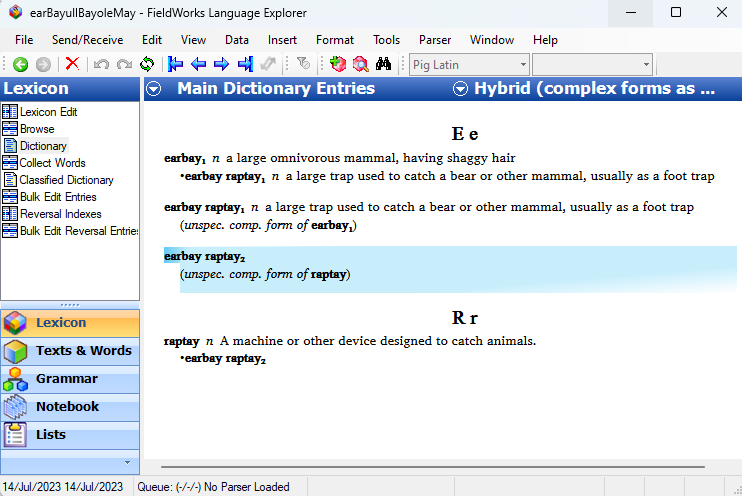
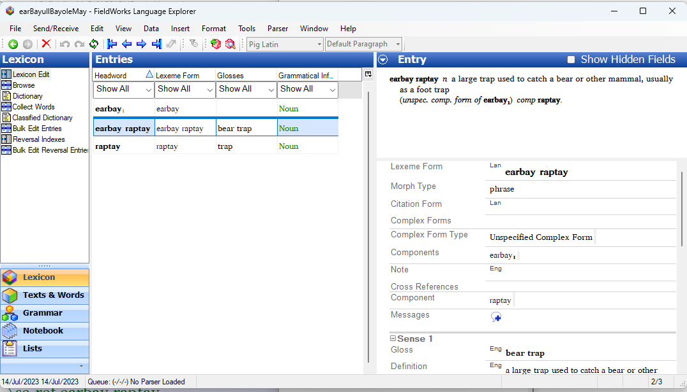

# AdjustMnRefs
This repo has an opl/de-opl script to adjust the main references and flag their corresponding subentry.

## Why run this script
When a complex form has multiple references to its components, those components will have subentry fields pointing back to the complex form. However, FLEx's import process assumes that a complex form will only have one component reference, second and subsequent components are ignored. When the entry records for those  components are imported FLex doesn't recognise them as components and creates empty entries for those items.

This script changes the markers of the second and subsequent components to the value set as *AltMainRefMarker* in the ini file. It then does a lookup on the entries of the components and flags the corresponding subentry markers by attaching a suffix to them *AltSubentrySuffix*.

## An Example
````SFM
\lx earbay
\hm 1
\et Middle English: bere
\sn 1
\ps n
\de a large omnivorous mammal, having shaggy hair
\se earbay raptay

\lx earbay raptay
\ps n
\ge bear trap
\de a large trap used to catch a bear or other mammal, usually as a foot trap
\mn earbay
\mn raptay

\lx raptay
\ps n
\ge trap
\de A machine or other device designed to catch animals.
\se earbay raptay
````
This is how the unmodified file gets imported:


This is how the file looks after the \mn references have been adjusted and the corresponding subentry markers have been flagged:

````SFM
\lx earbay
\hm 1
\et Middle English: bere
\sn 1
\ps n
\de a large omnivorous mammal, having shaggy hair
\se earbay raptay

\lx earbay raptay
\ps n
\ge bear trap
\de a large trap used to catch a bear or other mammal, usually as a foot trap
\mn earbay
\mnx raptay

\lx raptay
\ps n
\ge trap
\de A machine or other device designed to catch animals.
\se_ref earbay raptay
````
This is how the fixed file gets imported -- the *\\se_ref* fields have been imported with a *comp* lexical relation:


## The INI file
The *INI* file allows you to change the field and record markers within the file. Values set in the *INI* file will override the defaults or settings on the options on the command line.

## Bugs and Enhancements
